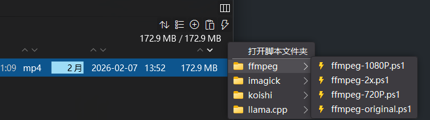

之前因为 Windows 自带资源管理器疯狂抽风爆炸猝死，导致我一心寻找其替代品。最开始要求只是别爆炸就行，后来找起来反而是要求越来越多了。寻找中也出现了很多替代品，包括微软商店就能下到的 Files，等等。

最后找到了 [OneCommander](https://onecommander.com/)，虽然付费但是价格合理且终身可用，这非常符合我的付费哲学。

## 那些我觉得值得一提的功能

### 以颜色标记修改间隔

这样你在多层文件夹的*上级*也能一眼定位你最近刚刚修改的那个文件。这里直接引用官网图片


### 可以设置别名的文件夹分组收藏功能

我就不懂为什么微软一直不做这个呢，别告诉我这也底层代码。
虽然资源管理器已经有固定收藏夹功能，但是他只显示最下级文件夹名，导致我有同样结构的不同项目时，其保存的子文件夹显示上*完全一样*！

但是 OneCommander 就可以设置**别名**，并且配置是以 json 格式文件保存在本地，方便搬家和批量修改。

而且也可以**分组**。虽然本人从设置了各种繁琐分组，到化繁为简，又重新思考分组规则也经历了几个阶段的时间，才把他调校成自己最顺手的状态。

### 多标签页

随着 Windows11 进化，资源管理器也自带了多标签页功能，但是就在我使用的短短一段时间里，不知道爆炸了多少次，而且每次爆炸之后之前打开的页面都需要再次重新打开……理想很好，但是完全不可用

OneCommander 的多标签页在重启之后也依然保持，虽然不能像 Edge 那样固定标签页或者标签页分组等各种骚操作，但已足够可用。

### 左右分栏

虽然资源管理器+桌面左右分屏也可以做到类似的效果，但 OneCommander 的分栏依然保持在一个进程，舒适舒适。

### 自带命令行启动指令

所以可以在不 hook explorer 的情况下，通过 ps1 固定到任务栏或 AHK 脚本快速完成“复制文件地址→功能打开”的操作。

（当然也可以在资源管理器右键快速打开。）

### 快捷启动 Script 功能

自带“当前文件夹”和“已选中的文件”等环境变量，结合 ps1 脚本等有很智慧的效果。也可以使用 bat，还有什么我忘了。

比如我最近喜欢让 AI 画几个四宫格图给我玩玩，所以我就需要一个随手就能用的切图工具。使用 OneCommander 的话，我这个流程就简化为

* 选中需要处理的文件（或多个文件）
* 右上角执行 Powershell 处理脚本
* 等待完成



当然脚本本身也是 AI 搓的。只要告诉他需求，诸如“使用$files = $env: SELECTED_FILES -split " `r` n"环境变量”，“兼容常见格式”，“输出文件的命名规则”，“适配多个文件的序列任务”之类的就可以。比如这里给一个 ffmpeg 压制成 720P 的简单示例。

```Powershell
# Get selected files from OneCommander
$files = $env:SELECTED_FILES -split "`r`n"

# Exit if no files were selected
if (-not $files -or $files.Count -eq 0) {
    Write-Host "No files selected. Exiting script."
    exit
}

foreach ($file in $files) {

    # Skip empty lines
    if ([string]::IsNullOrWhiteSpace($file)) { continue }

    # Check file extension
    $ext = [System.IO.Path]::GetExtension($file).ToLower()
    if ($ext -notin @(".mp4", ".mkv", ".mov", ".avi", ".flv", ".wmv", ".mpeg", ".mpg", ".webm", ".3gp", ".m4v", ".ts", ".m2ts")) {
        Write-Host "Skipping non-video file: $file"
        continue
    }

    # Build output file path (same name + suffix)
    $dir = [System.IO.Path]::GetDirectoryName($file)
    $name = [System.IO.Path]::GetFileNameWithoutExtension($file)

    $outFile = Join-Path $dir "$name`_720p$ext"

    Write-Host "Processing: $file"

    # 2. 720P 压制
    ffmpeg -i "$file" -vf "scale=720:-2,fps=60" -c:v libx264 -preset veryslow -crf 24 -c:a aac -b:a 64k "$outFile"
}
```

### 其他值得一提的功能

* 树状文件夹结构
* 自带文件快速预览器，也支持 QuickLook
* 可自定义的布局
* 对粘贴的链接进行快速脚本操作比如下载到本地
* 自带的 File Automator 可以快速处理文件格式或重命名等（有些和 Script 定位重复？）
* 在文件夹选择界面（例如下载界面）中弹出 One Commander 中已打开的文件夹
* 

## 我觉得还需要改进的功能

虽然这还是 Windows 的锅，但是右键菜单！！实在是！！要等太久了！

我希望他至少可以有固定一些右键菜单选项在主窗口上方或侧方的功能……